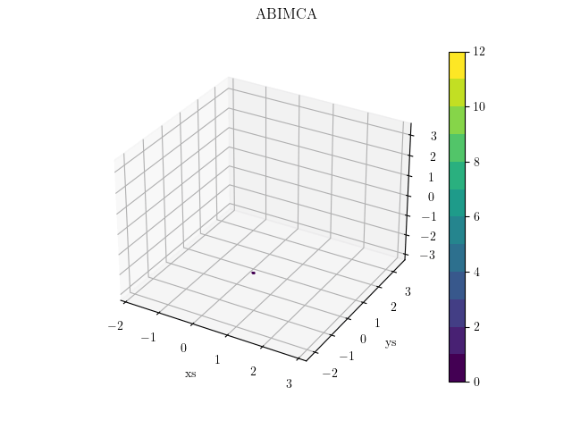

[](https://zenodo.org/badge/latestdoi/529262007) [](https://www.python.org/downloads/release/python-390/)

# Autoencoder Based Iterative Modeling and Subsequence Clustering Algorithm (ABIMCA)

This repository contains the python code for the Autoencoder Based Iterative Modeling and Subsequence Clustering Algorithm (ABIMCA)[^koehn] which is a deep learning method to separate multivariate time-series data (MTSD) into subsequences. It is beneficial in a variety of fields, to cluster MTSD into smaller segments or subsequences in an unsupervised manner. The ability to filter measurement data based on specific subsequences can improve downstream development products such as anomaly detection or machine diagnosis in condition based maintenance (CbM) strategies. Our algorithm is specifically useful for MTSD generated by a mechatronic system in a transient environment. It can be used offline as well as online for streaming data. It utilizes recurrent neural network (RNN) based Autoencoders (AE) by iteratively training a Base Autoencoder (BAE), generating a segmentation score and saving the intermediate parameters of the BAE to recognize previously identified subsequences.



# Usage

Package can be installed with pip

```bash
$ pip install abimca
```

or clone the repository, and cd into the directory. Then recommendation is to create a virtual environment after installing and using python 3.9 with [pyenv](https://github.com/pyenv/pyenv)

```python
python -m venv .venv
```
activate the environment
Linux:
    $ source .venv/bin/activate

Windows cmd:
    C:\> .venv\Scripts\activate.bat

Then install with [poetry](https://python-poetry.org/)

```bash
$ poetry install
```

Finally run the minimal example in *main.py*

```bash
$ python -m main
```

The above graphic example was generated with the *run_lorenz.py* script. The minimal example is as follows:

```python
import numpy as np
from abimca import SubsequenceIdentifier

# Generating random data. This will produce no class predictions or all points have the same class. For more reasonable results replace the data input with your mechatronic measurement data.

# Number of datapoints (time-steps)
n_p = 1000
# Number of dimensions or features
dim = 5
X = np.random.rand(n_p, dim)
# Number of clusters
n_c = 5
y = np.random.randint(n_c, size=n_p)

# Compute online clustering
si = SubsequenceIdentifier(disable_progress_bar=False)
si.fit(X)
print(f"Label array from online fitting: \n{si.label_array}")

# Compute offline clustering
labels = si.predict(X)
print(f"Label array from online fitting: \n{labels}")
```

## References
[^koehn]: Köhne, J. et al. Autoencoder based iterative modeling and multivariate time-series subsequence clustering algorithm
